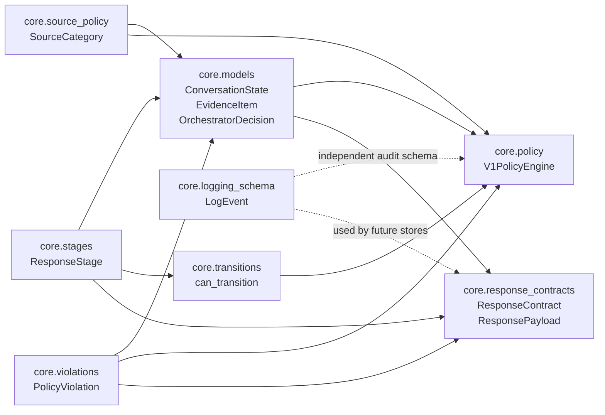
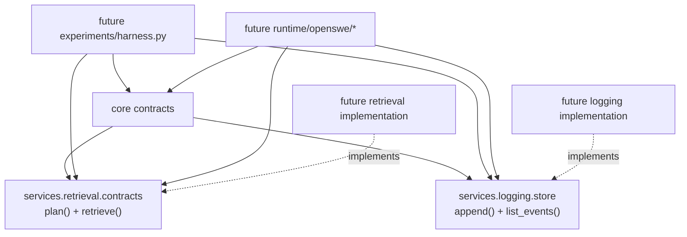
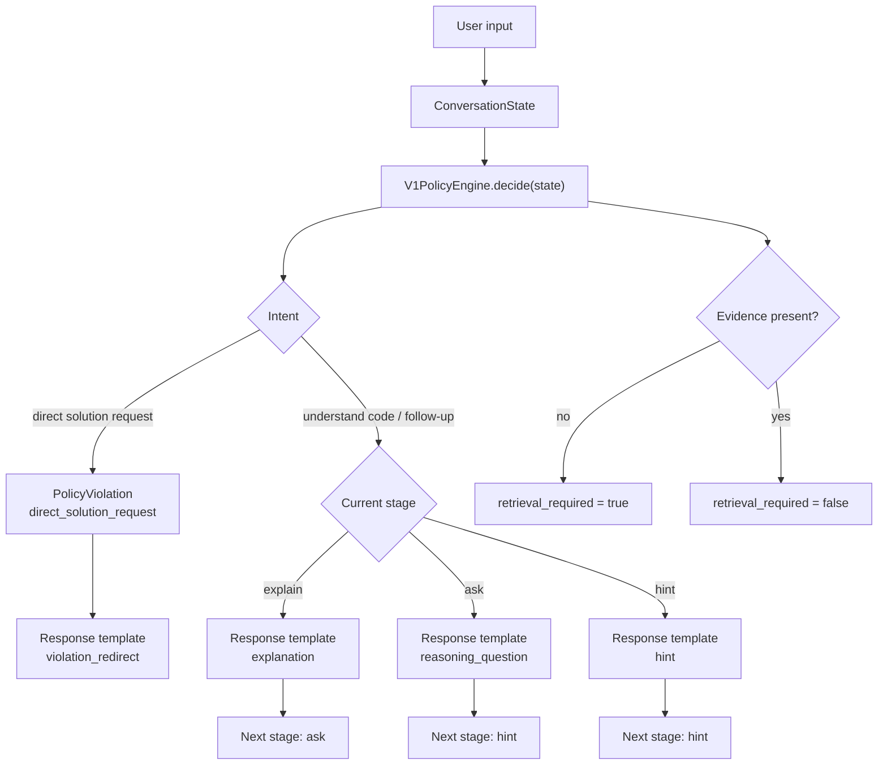

# Project Visualization

This file shows the current Guided Intelligence project structure as Mermaid diagrams. It is based on the local repository state, not on a live CodeGraphContext MCP connection.

## MCP Graph Tool Status

The NotebookLM source about a code graph MCP server is available as reference material in the project notebook, but this chat session does not currently expose that server as a callable MCP tool. The available callable tools here are NotebookLM, GitHub, and shadcn-related tools.

If a code graph MCP server is installed and exposed to this chat later, this document can be regenerated from that live graph instead of from local file inspection.

## Repository Map

```mermaid
flowchart TD
    repo["guidedInteligence/"]

    repo --> docs["Project docs"]
    docs --> agents["AGENTS.md<br/>NotebookLM project memory"]
    docs --> buildPlan["orchestration_build_plan.md<br/>Full roadmap"]
    docs --> boundaries["v1_boundaries.md<br/>Frozen v1 scope"]
    docs --> structure["PROJECT_STRUCTURE.md<br/>Central structure map"]
    docs --> visualization["PROJECT_VISUALIZATION.md<br/>Current diagrams"]

    repo --> core["core/<br/>Framework-independent orchestration contracts"]
    core --> models["models.py<br/>State, intent, evidence, decisions"]
    core --> stages["stages.py<br/>explain -> ask -> hint"]
    core --> transitions["transitions.py<br/>Allowed stage movement"]
    core --> sourcePolicy["source_policy.py<br/>Allowed source categories"]
    core --> violations["violations.py<br/>Explicit policy failures"]
    core --> policy["policy.py<br/>PolicyEngine + V1PolicyEngine"]
    core --> responseContracts["response_contracts.py<br/>Response templates + payloads"]
    core --> loggingSchema["logging_schema.py<br/>Audit event schema"]

    repo --> services["services/<br/>Replaceable service interfaces"]
    services --> retrieval["retrieval/contracts.py<br/>RetrievalPlan + RetrievalService"]
    services --> loggingStore["logging/store.py<br/>LoggingStore protocol"]
```

## Core Dependency Graph

## Service Boundary Graph

## V1 Decision Flow

