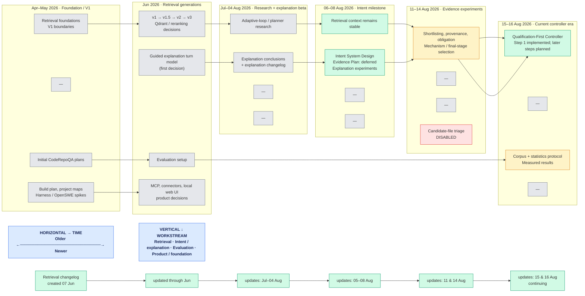

# Documentation Timeline and Status Map

## Purpose

This is the navigation map for the repository's human-readable design, decision,
experiment, and record files.  It separates a document's **historical value**
from its authority to describe the **current system**.

Git history is the ordering source.  A document's first-addition commit establishes
its first visible appearance; subsequent commits show that it remained a living
record.  Dates describe repository history, not necessarily the date a design was
implemented.  Uncommitted documentation edits are deliberately not assigned a
timeline date.

### Reading rule

For current runtime behavior, start with implementation, tests, active configs,
and the current decision records below.  Do not infer present behavior from a
versioned pipeline design, a build/refactor plan, a spike, or a benchmark plan.

| Status | Meaning |
| --- | --- |
| **Current decision / record** | A maintained decision or changelog.  Cross-check code and tests before relying on it as runtime truth. |
| **Active experiment / measurement** | A result, protocol, or scoped experiment; authoritative only for its stated boundary. |
| **Historical design** | Useful for lineage, but not a statement of current behavior. |
| **Superseded / deferred** | Explicitly retired, disabled, or intentionally postponed. |
| **Operational text / data** | Prompt, fixture, generated run output, or setup reference; not a design-history node. |

## Chronology, with parallel branches

The boxed columns are version-era boundaries, not releases.  Read the chart like
a plane: move **right** to move forward in time; move **down** to compare
parallel workstreams at the same time.  The separate bottom band deliberately
shows one file, `retrieval-changelog.md`, being updated across every period —
these are not duplicate documents.

## Branch map and document authority

### 1. Retrieval lineage and current controller

**Current decision / record**

- [Retrieval changelog](../services/retrieval/docs/retrieval-changelog.md) — living implementation and measurement record; created 2026-06-07 and updated through 2026-08-16.
- [Qualification-first native retrieval controller](../services/retrieval/docs/decisions/qualification_first_retrieval_controller.md) — current decision record; Step 1 is implemented/validated, while later named steps are planned.
- [CodeGraph for Codex retrieval experiment](../CODEGRAPH_CODEX_RETRIEVAL_EXPERIMENT.md) and [project-local CodeGraph setup](../CODEGRAPH_LOCAL_SETUP.md) — retained experiment/setup references, not a complete current-pipeline specification.

**Active experiment / measurement**

- [Backend-owned repository scope](../services/retrieval/docs/backend-owned-repository-scope.md), [direction-neutral productive provenance](../services/retrieval/docs/direction-neutral-productive-provenance.md), [offline shortlist signal audit](../services/retrieval/docs/offline-shortlist-signal-audit.md), [responsibility-aware shortlisting](../services/retrieval/docs/responsibility-aware-shortlisting.md), [stable obligation query strand](../services/retrieval/docs/stable-obligation-query-strand.md), [graph-connected obligation retrieval](../services/retrieval/docs/graph-connected-obligation-retrieval.md).
- [Mechanism-flow selection](../services/retrieval/docs/mechanism-flow-selection.md), [connected-evidence explanations](../services/retrieval/docs/connected-evidence-explanations.md), and [final-stage decision ledger](../services/retrieval/docs/final-stage-decision-ledger.md) — the selection branch introduced 2026-08-14.
- [Candidate-file triage](../services/retrieval/docs/candidate-file-triage.md) is explicitly **disabled**.  [Protected owner-file pool](../services/retrieval/docs/protected-owner-file-pool.md) is explicitly **superseded**.

**Historical designs — do not use as current behavior**

- `services/retrieval/docs/versions/v1/`, `v1_5/`, `v2/`, and `v3/` — retrieval versions from 2026-06-03 through 2026-06-10.  They are the clearest ordered lineage, but their filenames such as “current retrieval process” are historical names.
- `services/retrieval/docs/history/retrieval_explanation_refinement_rules.md` — historical rule set.
- Earlier decision records: `grouped_role_file_refinement_pipeline`, `reranking_redesign_summary`, `locagent_comparison`, `qdrant_hybrid_design`, `codex_tool_using_agent_runtime`, and `connected_source_context_amplification`.
- [LLM evidence graph token plan](../LLM_EVIDENCE_GRAPH_TOKEN_PLAN.md) — a design plan, not proof of the active implementation.

### 2. Intent, explanation, and teaching flow

**Current / retained contract**

- [Intent system design](intent_system_design.md) — introduced 2026-08-06 and updated 2026-08-07.  It is the first-rewrite contract for intent classification and its handoff to retrieval/explanation.
- [Guided explanation turn model](../services/retrieval/docs/decisions/guided_explanation_turn_model.md) — maintained decision, last changed with the intent milestone; verify against the current response-generation code when asserting present behavior.

**Deferred or historical — do not present as current**

- [Evidence plan deferred design](evidence_plan_deferred_design.md) — explicitly deferred and excluded from the first intent rewrite.
- [Explanation-generation changelog](history/explanation-generation-changelog.md) and [design conclusions](history/explanation-generation-design-conclusions.md) — explanation lineage (2026-08-04 to 2026-08-06), not a current-system spec.
- [Explanation-generation experiments](explanation_generation_experiments_20260807.md) and [Luna experiments](explanation_generation_luna_experiments_20260807.md) — single-date experimental records.

### 3. Evaluation and benchmark branch

**Active measurement/reference**

- `testing/codeRepoQA/corpus/README.md`, `benchmark-groups.md`, and `cases.md` — corpus definition introduced 2026-06-23 and refreshed 2026-08-15.
- `testing/codeRepoQA/statistics/RETRIEVAL_STATISTICS_PROTOCOL.md`, `RETRIEVAL_STATISTICS_CORPUS_SPLIT.md`, `EXAMPLE_RETRIEVAL_STATISTICS.md`, and `runs/2026-08-15-native-vs-codex.md` — a deliberately bounded evaluation protocol and results.
- `testing/codeRepoQA/CodeRepoQA evaluation setup.md` — operational setup reference, not a system-behavior decision.

**Historical research / planning — do not use as current behavior**

- The `workspace retrieval *.md` research sequence: adaptive-loop research, planner direction, source-grounded Step 2 design, and current-techniques failure analysis (2026-07-07 onward).  These explain why the later controller work exists; they do not specify its final behavior.
- `CodeRepoQA plan.md` and `RAG retrieval implementation plan.md` — initial planning artifacts from 2026-05-07.

### 4. Product, orchestration, and connector branch

**Historical plans and decisions — not current behavior**

- `docs/orchestration_build_plan.md`, `docs/orchestration_refactor_plan.md`, `docs/v1_boundaries.md`, `docs/PROJECT_STRUCTURE.md`, and `docs/PROJECT_VISUALIZATION.md` — original V1 and refactor framing (Apr–Jun); some were later reorganized, but none is a current-runtime contract.
- `services/retrieval/docs/local_web_ui_and_vscode_extension_plan.md`, `mcp_connected_source_retrieval_first.md`, and `remote_and_local_mcp_connector_separation.md` — product and connector decisions from Jun 2026.  Treat as historical unless code/configuration independently confirms a point.
- `docs/history/harness-spikes/` — archived Step 3/4 feasibility work.  The directory name correctly signals that these are not a current architecture.

## Textual material intentionally omitted from the graph

These files remain valuable, but showing them as architecture nodes would be misleading.

| Material | Why it is omitted |
| --- | --- |
| `services/**/prompts/*.md` and `services/retrieval/codex/profiles/**` | Runtime prompt/profile text.  It can affect behavior, but Git chronology of a prompt is not architecture history; refer to the selected config/profile and code. |
| `testing/codeRepoQA/batch-runs/**` | Generated run prompts, stderr/stdout, and evaluator outputs.  They are evidence artifacts, not design documents. |
| `testing/codeRepoQA/corpus/cases/**`, `selection_manifest.json`, and `testing/codeRepoQA/6.json` | Benchmark inputs, issue/verification data, and corpus-selection data rather than design records. |
| `testing/codeRepoQA/runs/local-smoke/**` and `testing/codeRepoQA/statistics/runs/*.json` | Machine-produced local smoke/index and statistics artifacts; their accompanying human-readable protocol/report is mapped above. |
| `configs/**/*.json`, `docker-compose.qdrant.yml`, `package.json`, and `requirements.txt` | Executable configuration/dependency manifests.  They determine an active run but do not form an architecture-history branch. |
| `docs/obsidian/**` | Imported/source-text examples and certification/conflict samples, not project decisions. |
| `README.md` files, `configs/README.md`, `tests/external_connectors/README.md`, `tmp/thesis-template/README.md` | Local usage/reference material; only include them in a timeline if they themselves become a decision record. |
| `AGENTS.md` | Operating instructions for contributors/agents, not system architecture. |

## Uncertainty and review points

- The Git timeline is high confidence for file additions and updates.  Where documents describe proposed work, Git cannot prove the proposal became active; those are labeled historical, deferred, or experimental unless a maintained decision record says otherwise.
- The NotebookLM project source is configured in `AGENTS.md`, but it was unavailable here because the current browser session is not signed in.  No ordering or authority claim in this map depends on it.
- At the time of this map, Git reports uncommitted changes to `services/retrieval/docs/retrieval-changelog.md` and `services/retrieval/docs/decisions/qualification_first_retrieval_controller.md`.  Their changes are intentionally not dated or interpreted here until committed.
