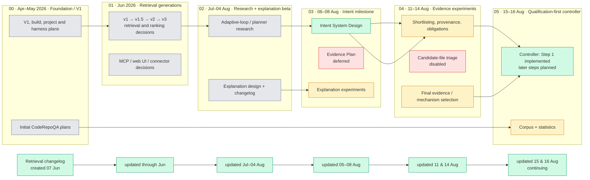

# Guided Intelligence Development History

This directory is a chronological reading set for understanding how the system
developed.  Its numbered folders are ordered from oldest to newest.  Every file
inside them is an unmodified copy of a source document from the repository at
the time this directory was assembled; the filename encodes the original path
with `__` in place of path separators.

Use this directory as the source of truth for **development history and design
lineage**.  It is not a substitute for implementation, tests, and active
configuration when establishing present runtime behavior.

## How to read the map

- **Horizontal direction:** time, from older at left to newer at right.
- **Vertical direction:** workstreams operating in parallel during a period:
  retrieval; intent/explanation; evaluation; and product/foundation.
- **Columns:** development eras, not formal product releases.
- **Green:** retained/current decision or continuing record. **Amber:** a
  scoped experiment or measured result. **Grey:** historical design. **Red:**
  explicitly deferred, disabled, or superseded work.

The bottom row represents one continuing document, not six documents:
`services/retrieval/docs/retrieval-changelog.md`.  Its copied snapshot is in
`05-qualification-first-controller/` because that is the latest dated era in
this history set.

## Folder guide

| Folder | Period and purpose | Copies |
| --- | --- | ---: |
| `00-foundation-v1` | Original V1, orchestration, project-map, harness, and early CodeRepoQA planning. | 11 |
| `01-retrieval-generations` | Ordered v1–v3 retrieval designs, redesign decisions, and early connector/product direction. | 18 |
| `02-research-explanation-beta` | Adaptive retrieval/planner research alongside the explanation beta and its changelog. | 6 |
| `03-intent-milestone` | The intent rewrite contract, related explanation experiments, and the separately deferred Evidence Plan. | 5 |
| `04-evidence-experiments` | Candidate, provenance, obligation, and final-evidence experiments; includes the disabled/superseded records for honest lineage. | 11 |
| `05-qualification-first-controller` | Current controller decision, continuing retrieval changelog, CodeGraph notes, corpus definition, and measured statistics. | 11 |

## Important interpretation notes

- A document placed later is newer in Git history; it is not automatically a
  replacement for every older document.
- Plans, spikes, and experiments are retained because they explain decisions,
  even when they did not become current behavior.
- The `04-evidence-experiments` folder intentionally keeps disabled and
  superseded work so a reader can see what was tried and rejected.
- The active source paths remain authoritative for future edits.  This reading
  set is deliberately copy-only and should be regenerated when the historical
  corpus needs to include later commits.
