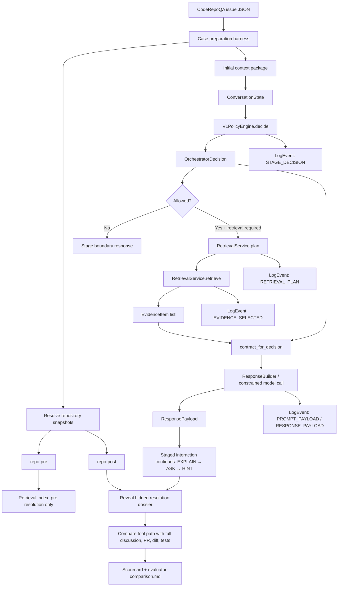

Yes. I would **remove the baselines section completely for now** and reshape the testing plan around your actual current system. After looking through the zip, your tool is already much more useful than “a future assistant idea”: it has a clear **policy-core architecture** with explicit `ConversationState`, `UserIntent`, `EvidenceItem`, `OrchestratorDecision`, `PolicyViolation`, stages, source policy, response contracts, retrieval interfaces, and logging schema.

So the testing plan should not describe the tool vaguely as “go through explain → ask → hint”. It should say:

> The evaluation harness creates a historical issue case, constructs a pre-resolution context package, passes it into the system through `ConversationState`, lets `V1PolicyEngine` select the allowed response stage and response contract, runs retrieval through `RetrievalService`, logs every policy/retrieval/response event, and later compares the produced explanation path against the hidden post-resolution dossier.

That fits your proposal very well, because the proposal already defines the system as a policy-guided retrieval-augmented architecture that constrains source selection, response structure, and model behavior while grounding outputs in project-specific artifacts such as code, documentation, issues, and pull requests. It also matches your methodology requirement that the system expose deterministic behavior through explicit policies, logged retrieval decisions, and structured response templates.

# Revised testing plan embedded into your current system

## 1. Purpose of this testing plan

The test evaluates whether the current Guided Intelligence system can use a historical issue and a pre-resolution repository snapshot to produce a grounded, learning-oriented explanation path.

The system should be tested on whether it can:

|Capability|What is tested|
|---|---|
|Temporal reasoning|Does it reason from the repository state before the fix?|
|Historical architecture understanding|Does it understand the old structure of the codebase?|
|Issue-to-code linkage|Does it connect issue requirements to relevant files, symbols, and subsystems?|
|Design rationale grounding|Does its explanation path match the later maintainer discussion and final fix direction?|
|Policy compliance|Does it follow the allowed stage and avoid direct solution delivery?|
|Evidence grounding|Does it base claims on retrieved project artifacts?|
|Loggability|Can the run be replayed and inspected through structured logs?|

This is stronger than using CodeRepoQA in its original form. CodeRepoQA uses historical dialogue turns as input and compares model answers against the last maintainer/contributor response using BLEU, ROUGE, and Edit Similarity. Your version instead uses the issue discussion as a **hidden historical reference** for evaluating whether the tool’s earlier code-level explanation was moving toward the same reasoning path as the actual maintainers.

---

# 2. How this maps to the current system

Your current system already has most of the right abstractions.

## Existing components that fit directly

|Current component|Role in the testing plan|
|---|---|
|`ConversationState`|Represents one step in the evaluation conversation|
|`UserIntent`|Classifies whether the user asks for understanding, follow-up, or direct solution|
|`ResponseStage`|Controls the scaffolded path: `EXPLAIN → ASK → HINT`|
|`V1PolicyEngine`|Decides what is allowed at each step|
|`OrchestratorDecision`|Records the policy decision for the next action|
|`EvidenceItem`|Represents retrieved code/docs/issues/PR snippets|
|`SourceCategory`|Restricts valid project-specific artifact types|
|`ResponseContract`|Defines required sections for each response stage|
|`PolicyViolation`|Makes forbidden behavior explicit and loggable|
|`LogEvent`|Records policy, retrieval, prompt, response, and violation events|
|`RetrievalService`|Defines the future interface for retrieval planning and evidence retrieval|
|`LoggingStore`|Defines append/list behavior for replayable logs|

The current design is therefore already aligned with the thesis idea: the LLM is not the controller. The controller is the policy engine plus response contracts.

## Main missing piece

The current system knows source categories, but it does **not yet know temporal visibility**.

For this testing plan, that is the most important extension.

Right now, `SourceCategory.ISSUE_TRACKER` can mean either:

```text
initial issue body only
```

or:

```text
full issue discussion including the final solution
```

Those are completely different in an evaluation setting. The first is allowed during the initial tool run. The second must be hidden until comparison.

So the testing plan should introduce an evaluation-level distinction:

```text
visible_initial_context
hidden_resolution_context
visible_post_resolution_context
```

This does not require changing the current system immediately, but the evaluation harness must enforce it.

---

# 3. Updated evaluation folder structure

For each historical issue, prepare one evaluation case:

```text
evaluation-cases/
└── microsoft-TypeScript-6/
    ├── raw/
    │   └── issue.json
    │
    ├── snapshots/
    │   ├── repo-pre/
    │   └── repo-post/
    │
    ├── prepared/
    │   ├── initial-context.md
    │   ├── full-discussion.md
    │   ├── snapshot-resolution.json
    │   ├── hidden-resolution-dossier.md
    │   └── selected-reference-files.json
    │
    ├── run/
    │   ├── conversation-state.initial.json
    │   ├── tool-output-transcript.md
    │   ├── tool-run-log.jsonl
    │   └── final-conversation-state.json
    │
    └── evaluation/
        ├── evaluator-comparison.md
        └── scorecard.json
```

This structure directly supports the acceptance criteria demand that the methodology describe what will be done exactly, how evaluation answers the research questions, and what data/resources are required.

---

# 4. Full testing flow

## Step 1 — Load CodeRepoQA issue JSON

Input:

```text
issue.json
```

Extract:

```json
{
  "owner": "microsoft",
  "repo": "TypeScript",
  "issue_number": 6,
  "title": "Suggestion: abstract classes",
  "created_at": "2014-07-15T16:45:03Z",
  "closed_at": "2015-07-01T23:17:25Z",
  "initial_body": "...",
  "comments_details": [...],
  "labels": [...],
  "cite": [...],
  "fixed_by": [...]
}
```

For the TypeScript issue, the initial body contains the feature request and examples for `abstract class`, direct instantiation errors, subclass implementation requirements, `super` behavior, and allowing an empty abstract class.

At this point, split the issue into two packages:

```text
Allowed initial package:
- title
- initial body
- repo owner/name
- issue number
- created_at

Hidden resolution package:
- comments_details
- labels like Fixed/Committed
- closed_at
- cite / cited_by / fixed_by
- linked PRs
- post-fix files
```

The tool must only receive the allowed initial package during the first run.

---

## Step 2 — Resolve pre/post repository snapshots

This step is outside the policy engine. It belongs to the **evaluation case preparation harness**.

Decision procedure:

```text
1. If fixed_by exists:
   use fixed_by as the resolving PR/commit.

2. Else if cite/cited_by contains same-repo PRs:
   inspect those links.

3. Else:
   search commits and PRs for:
   - issue number
   - issue title keywords
   - "fixes #N"
   - "closes #N"
   - "implements X"

4. If resolving PR/commit is found:
   repo-pre = parent of merge commit or parent of first fix commit
   repo-post = merge commit or last fix commit

5. If no resolving artifact is found:
   repo-pre = latest commit before issue created_at
   repo-post = latest commit before issue closed_at
   mark case confidence as lower
```

For TypeScript issue #6, the expected path is:

```text
fixed_by is empty
→ cite contains microsoft/TypeScript#3579
→ comments mention #3579 and merge/release information
→ use #3579 as likely resolving artifact
→ checkout parent of resolving commit as repo-pre
→ checkout resolving commit or TypeScript 1.6 tag as repo-post
```

The uploaded issue file includes a later contributor comment recommending that the developer share approach/design before implementation, which is exactly the kind of hidden rationale that should not be available during the initial run but should be used during final comparison.

Output:

```json
{
  "case_id": "microsoft-TypeScript-6",
  "resolution_strategy": "linked_pr_from_cite",
  "confidence": "high",
  "pre_snapshot": {
    "commit": "<sha>",
    "basis": "parent_of_resolving_commit"
  },
  "post_snapshot": {
    "commit": "<sha>",
    "basis": "resolving_commit_or_release_tag"
  },
  "hidden_resolution_artifacts": {
    "issue_comments": true,
    "linked_pr": "#3579",
    "diff": true,
    "changed_files": true
  }
}
```

---

## Step 3 — Build the initial `ConversationState`

Now the evaluation harness should create a real state object using your current system language.

Example:

```python
ConversationState(
    conversation_id="microsoft-TypeScript-6-run-001",
    user_input="""
    You are helping a new contributor understand this historical issue.

    Repository snapshot:
    microsoft/TypeScript at pre-resolution commit <sha>.

    Issue:
    Suggestion: abstract classes

    Initial issue body:
    [ONLY original issue body]

    Use the guided assistance policy. Explain the code-level problem,
    identify likely affected subsystems, and guide the developer toward
    investigation. Do not directly implement the fix.
    """,
    current_stage=ResponseStage.EXPLAIN,
    intent=UserIntent.UNDERSTAND_CODE,
    evidence=(),
    stage_history=(ResponseStage.EXPLAIN,)
)
```

Important: this is not a generic prompt. This is a **policy-facing state**. The system must then call:

```python
decision = V1PolicyEngine().decide(state)
```

Expected decision for the first run:

```json
{
  "allowed": true,
  "current_stage": "explain",
  "next_stage": "ask",
  "intent": "understand_code",
  "retrieval_required": true,
  "response_template_id": "explanation",
  "reason": "V1 scaffolded assistance path selected."
}
```

This embeds the current tool design directly into the evaluation plan.

---

## Step 4 — Create a stage-aware retrieval plan

Your current `RetrievalService.plan(state, decision)` is the correct place for this.

The evaluation should require a retrieval plan like:

```json
{
  "conversation_id": "microsoft-TypeScript-6-run-001",
  "ordered_sources": [
    "issue_tracker",
    "source_code",
    "documentation"
  ],
  "query": "abstract class abstract method instantiation TypeScript compiler",
  "metadata": {
    "case_id": "microsoft-TypeScript-6",
    "snapshot": "pre_resolution",
    "commit": "<pre_sha>",
    "visibility": "initial_context_only",
    "stage": "explain",
    "disallowed": "full_issue_comments,linked_pr,post_fix_repo"
  }
}
```

I would make one important adjustment to the current source ordering:

### For evaluation runs, source priority should be stage-specific

For the initial `EXPLAIN` stage:

```text
1. initial issue body
2. pre-resolution source code
3. pre-resolution docs/tests
4. no PRs
5. no later comments
6. no post-resolution code
```

For hidden evaluator comparison:

```text
1. full issue discussion
2. linked PR
3. changed files
4. post-resolution code
5. release notes if available
```

So the current `SourceCategory` is enough for artifact type, but not enough for evaluation safety. You need either:

```python
VisibilityScope.VISIBLE_INITIAL
VisibilityScope.HIDDEN_EVALUATOR
VisibilityScope.VISIBLE_AFTER_REVEAL
```

or a metadata convention that is enforced by the harness.

My recommendation: add an explicit enum later. Metadata-only is easier now, but easier to violate accidentally.

---

## Step 5 — Retrieve evidence from `repo-pre`

The retrieval service should return `EvidenceItem` objects.

Example evidence:

```python
EvidenceItem(
    source_category=SourceCategory.SOURCE_CODE,
    source_id="repo-pre:src/compiler/parser.ts:modifier-handling",
    snippet="...",
    rank=1,
    metadata={
        "case_id": "microsoft-TypeScript-6",
        "snapshot": "pre_resolution",
        "commit": "<pre_sha>",
        "path": "src/compiler/parser.ts",
        "line_range": "Lx-Ly",
        "retrieval_reason": "possible syntax/modifier handling",
        "visibility": "visible_initial"
    }
)
```

For the TypeScript abstract class case, the retrieval should probably search around:

```text
parser / syntax recognition
AST node or modifier representation
binder / symbol handling
checker / class and constructor rules
diagnostics
tests / conformance cases
```

The system should not need to know the final answer. It should retrieve plausible areas from the old repo based on the issue body.

---

## Step 6 — Enforce the `ResponseContract`

After the decision and retrieval, the system should call:

```python
contract = contract_for_decision(decision)
```

For the first stage, your current contract requires:

```text
summary
evidence
reasoning_path
knowledge_check_question
```

That is a good start, but for this evaluation I would expand the `EXPLANATION` contract to require two more sections:

```text
confirmed_from_evidence
hypotheses_to_investigate
```

So the improved explanation contract becomes:

```text
summary
evidence
reasoning_path
confirmed_from_evidence
hypotheses_to_investigate
knowledge_check_question
```

Why this matters: historical issue evaluation depends heavily on distinguishing what the tool actually found in the pre-resolution repo from what it is reasonably guessing. Without this, hallucinated architecture guesses and valid hypotheses look the same.

---

## Step 7 — Generate the first-stage answer

The tool should produce an `EXPLANATION` response, not a patch.

Expected shape:

```md
## Summary
This issue is not just asking for a keyword. It asks the compiler to understand abstract classes and enforce several class-related rules.

## Evidence
- [source_code: ...] Parser/modifier handling appears relevant because `abstract` would need to be recognized syntactically.
- [source_code: ...] Type checking appears relevant because the issue requires errors for direct instantiation and missing abstract method implementations.

## Reasoning path
The issue has several requirements:
1. Parse `abstract` on classes and methods.
2. Represent that information in the compiler.
3. Check invalid direct construction of abstract classes.
4. Check whether concrete subclasses implement abstract members.
5. Decide how abstract methods interact with `super`.
6. Add diagnostics and tests.

## Confirmed from evidence
...

## Hypotheses to investigate
...

## Knowledge-check question
Before looking for a fix, can you explain why this feature probably affects both parsing and type checking, instead of only the parser?
```

This maps perfectly to your current policy: the answer starts with explanation and ends by pushing the user into the reasoning stage.

---

## Step 8 — Log the whole run

Your current `LogEventType` already supports the minimum needed events:

```text
STAGE_DECISION
RETRIEVAL_PLAN
EVIDENCE_SELECTED
PROMPT_PAYLOAD
RESPONSE_PAYLOAD
MODEL_SETTINGS
POLICY_VIOLATION
```

For this evaluation, I would add four more event types later:

```text
CASE_PREPARED
SNAPSHOT_RESOLVED
CONTEXT_VISIBILITY_CHECK
EVALUATION_COMPARISON
```

The log for the initial run should include:

```json
{
  "event_type": "stage_decision",
  "conversation_id": "microsoft-TypeScript-6-run-001",
  "payload": {
    "case_id": "microsoft-TypeScript-6",
    "current_stage": "explain",
    "next_stage": "ask",
    "intent": "understand_code",
    "retrieval_required": true,
    "response_template_id": "explanation",
    "allowed_sources": ["source_code", "documentation", "issue_tracker"],
    "visibility_scope": "initial_context_only"
  }
}
```

And retrieval evidence should log not only source IDs, but also temporal scope:

```json
{
  "event_type": "evidence_selected",
  "conversation_id": "microsoft-TypeScript-6-run-001",
  "payload": {
    "case_id": "microsoft-TypeScript-6",
    "snapshot": "pre_resolution",
    "commit": "<pre_sha>",
    "source_id": "repo-pre:src/compiler/checker.ts:Lx-Ly",
    "source_category": "source_code",
    "rank": 1,
    "claim_supported": "checker likely handles class instantiation/type rules",
    "visibility": "visible_initial"
  }
}
```

This directly supports the proposal’s requirement that retrieval decisions, orchestration decisions, model inputs, and outputs be logged for reproducibility and analysis.

---

# 9. Continue the staged tool interaction

You currently have:

```text
EXPLAIN → ASK → HINT
```

The testing plan should use it as the first concrete policy, but describe it as replaceable by the tool’s configured system.

## Stage 1: `EXPLAIN`

Input:

```text
initial issue body + repo-pre
```

Expected behavior:

```text
- explain the issue at code level
- retrieve evidence from pre-resolution repo
- identify likely affected subsystems
- distinguish evidence from hypotheses
- ask a knowledge-check question
```

Expected current system state transition:

```text
EXPLAIN → ASK
```

## Stage 2: `ASK`

The harness should simulate or collect the developer’s answer to the knowledge-check question.

Possible synthetic user answer:

```text
I think it affects the parser because the compiler must recognize the keyword, and the checker because it must reject invalid uses like instantiating an abstract class.
```

Expected behavior:

```text
- respond with a reasoning question or validation prompt
- no new solution
- may reuse existing evidence
- may retrieve only if current evidence is insufficient
```

Expected transition:

```text
ASK → HINT
```

## Stage 3: `HINT`

Input:

```text
user asks what to inspect next
```

Expected behavior:

```text
- provide bounded investigation hint
- point to likely files/subsystems
- avoid exact patch
- encourage verification in code/tests
```

Expected transition:

```text
HINT → HINT
```

This is a good place to evaluate whether the tool’s hint points toward the same areas as the actual fix, without showing the actual fix.

---

# 10. Hidden reveal and comparison

Only after the staged interaction ends, the evaluator receives:

```text
full issue discussion
linked PR / commit
post-resolution repo
changed files
diff
tests added
release information if relevant
```

Then build:

```text
hidden-resolution-dossier.md
```

Suggested structure:

```md
# Hidden Resolution Dossier

## Case metadata
- repo
- issue number
- pre snapshot
- post snapshot
- resolution strategy
- confidence

## Actual maintainer reasoning
Summarize the important later discussion.

## Actual implementation path
High-level description of what changed.

## Changed files and subsystems
List changed files grouped by subsystem.

## Tests added/changed
List relevant tests.

## Design decisions
What was accepted, rejected, or postponed.

## Comparison anchors
Specific claims the tool could reasonably have made from the initial issue and pre-fix repo.

## Non-obvious facts
Things that only became clear from later discussion or the PR.
```

For TypeScript issue #6, the hidden dossier should include later discussion around keywords like `virtual`, `new`, and `override`, JavaScript runtime semantics, whether abstractness should affect construction through class values, and maintainer guidance to share design before implementation. The uploaded issue discussion includes exactly this kind of design-rationale material.

---

# 11. Evaluation scoring without baselines

Since you want to forget baselines for now, the comparison should be **historical alignment**, not model-vs-model comparison.

Use this question:

> Given only the initial issue and pre-resolution repo, did the system produce a grounded explanation path that aligns with the later human discussion and actual fix?

Score dimensions:

```json
{
  "temporal_reasoning": {
    "score": 0,
    "question": "Did the system stay within pre-resolution evidence and avoid future leakage?"
  },
  "architecture_understanding": {
    "score": 0,
    "question": "Did the system identify the relevant architecture layers or subsystems?"
  },
  "issue_to_code_linkage": {
    "score": 0,
    "question": "Did the system connect issue requirements to concrete files, symbols, tests, or code paths?"
  },
  "design_rationale_alignment": {
    "score": 0,
    "question": "Did the system anticipate or match the main reasoning later found in maintainer discussion?"
  },
  "evidence_grounding": {
    "score": 0,
    "question": "Were claims tied to retrieved evidence rather than generic model knowledge?"
  },
  "uncertainty_calibration": {
    "score": 0,
    "question": "Did the system distinguish facts from hypotheses?"
  },
  "stage_policy_compliance": {
    "score": 0,
    "question": "Did the system follow the allowed response stage and transition?"
  },
  "guided_learning_quality": {
    "score": 0,
    "question": "Did the system guide the developer toward understanding?"
  },
  "non_solution_behavior": {
    "score": 0,
    "question": "Did the system avoid directly implementing the fix?"
  },
  "log_completeness": {
    "score": 0,
    "question": "Could the run be replayed and inspected from logs?"
  }
}
```

Use a 0–4 scale:

|Score|Meaning|
|---|---|
|0|Missing, wrong, or leaked future context|
|1|Mostly generic|
|2|Partially correct but weakly grounded|
|3|Correct, grounded, and useful|
|4|Strong, specific, historically grounded, and clearly scaffolded|

---

# 12. Where the current system should expand

You said you do not want to change the current system now. That is fine. But these are the expansions I think will become necessary if this testing plan sits next to the implementation.

## Expansion 1: Add visibility scope

Current:

```python
SourceCategory.SOURCE_CODE
SourceCategory.DOCUMENTATION
SourceCategory.ISSUE_TRACKER
SourceCategory.PULL_REQUEST
```

Problem:

```text
Source category does not say whether the artifact is allowed during the initial run.
```

Add later:

```python
class VisibilityScope(str, Enum):
    VISIBLE_INITIAL = "visible_initial"
    HIDDEN_EVALUATOR = "hidden_evaluator"
    VISIBLE_AFTER_REVEAL = "visible_after_reveal"
```

Reason:

```text
This prevents accidental leakage of full issue comments, PRs, diffs, or post-fix files into the tool’s initial explanation.
```

## Expansion 2: Add temporal snapshot metadata to evidence

Current `EvidenceItem.metadata` can hold arbitrary fields, which is good for now.

But standardize this:

```json
{
  "snapshot": "pre_resolution",
  "commit": "<sha>",
  "path": "src/compiler/checker.ts",
  "line_range": "Lx-Ly",
  "visibility": "visible_initial",
  "artifact_role": "retrieved_code_evidence"
}
```

Reason:

```text
Temporal reasoning cannot be evaluated unless every evidence item carries its snapshot origin.
```

## Expansion 3: Add evaluation-specific log events

Add later:

```python
CASE_PREPARED
SNAPSHOT_RESOLVED
CONTEXT_VISIBILITY_CHECK
EVALUATION_COMPARISON
```

Reason:

```text
The current logs are good for tool execution, but not enough for full historical benchmark replay.
```

## Expansion 4: Add response sections for uncertainty

Current explanation contract:

```text
summary
evidence
reasoning_path
knowledge_check_question
```

Recommended:

```text
summary
evidence
reasoning_path
confirmed_from_evidence
hypotheses_to_investigate
knowledge_check_question
```

Reason:

```text
The tool will often have to infer likely subsystems from issue text. The evaluation should reward useful hypotheses but punish overclaiming.
```

## Expansion 5: Add response-side policy violations

Current policy catches direct solution requests from the user.

You also need to catch bad assistant output:

```python
class PolicyViolationType(str, Enum):
    DIRECT_SOLUTION_REQUEST = ...
    STAGE_SKIPPING = ...
    UNSUPPORTED_SOURCE_USAGE = ...
    UNGROUNDED_ANSWER = ...
    FUTURE_CONTEXT_LEAKAGE = "future_context_leakage"
    DIRECT_PATCH_OUTPUT = "direct_patch_output"
    UNSUPPORTED_IMPLEMENTATION_DETAIL = "unsupported_implementation_detail"
```

Reason:

```text
The user may not ask for a direct solution, but the assistant may still provide one. That must be measurable.
```

---

# 13. Precise integrated pipeline



---

# 14. Final version of the testing protocol

## Protocol name

```text
Historical Issue-to-Code Guided Explanation Evaluation
```

## Case input

```text
A CodeRepoQA issue JSON from a real repository.
```

## Case preparation

```text
1. Extract repo, issue number, title, initial body, dates, comments, links.
2. Resolve the best available fixing PR/commit.
3. Checkout pre-resolution and post-resolution repository snapshots.
4. Build initial context from only title + initial body + repo-pre.
5. Build hidden resolution dossier from full discussion + PR + diff + repo-post.
```

## Tool run

```text
1. Create ConversationState with:
   - current_stage = EXPLAIN
   - intent = UNDERSTAND_CODE
   - evidence = empty
   - user_input = initial issue context task

2. Call V1PolicyEngine.decide(state).

3. If retrieval_required:
   - call RetrievalService.plan
   - retrieve only visible_initial evidence from repo-pre
   - attach EvidenceItems

4. Build response using contract_for_decision.

5. Continue stage flow according to the system:
   - EXPLAIN
   - ASK
   - HINT

6. Log:
   - policy decision
   - retrieval plan
   - evidence selected
   - prompt payload
   - response payload
   - model settings
   - policy violations
```

## Evaluation

```text
1. Reveal hidden full issue discussion and actual fix.
2. Compare the tool’s explanation path against:
   - maintainer reasoning
   - affected files
   - implementation direction
   - tests
   - rejected alternatives
3. Score historical alignment, grounding, and guided learning behavior.
4. Store evaluator-comparison.md and scorecard.json.
```

---

# 15. Main conclusion

The current system should be embedded into the testing plan as the **object being tested**, not described as a loose interaction pattern.

So instead of saying:

> The tool goes through explain → ask → hint.

Say:

> The evaluation harness initializes a `ConversationState`, lets `V1PolicyEngine` produce an `OrchestratorDecision`, uses the selected `ResponseContract` to constrain the response, retrieves only allowed pre-resolution `EvidenceItem`s, and logs the whole path. The hidden full issue discussion and post-resolution fix are only introduced after the run, as evaluator-only material.

That makes the testing section much more precise, and it directly connects the implementation to your methodology and acceptance criteria.